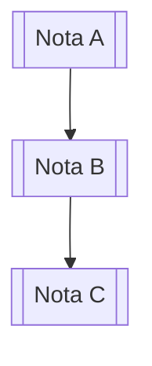

# Obsidian Flavored Markdown

Obsidian extiende CommonMark y GFM con wikilinks, embeds, callouts, propiedades, comentarios y otra sintaxis propia.

## Flujo de trabajo

1. Añade frontmatter con propiedades (título, tags, aliases)
2. Escribe contenido usando Markdown estándar más las extensiones de Obsidian
3. Enlaza notas relacionadas con wikilinks para conectar el vault
4. Embebe contenido de notas, imágenes o PDFs cuando sea útil
5. Añade callouts para resaltar información importante
6. Verifica que la sintaxis sea correcta antes de guardar

## Propiedades (frontmatter YAML)

Las propiedades van al inicio del archivo entre líneas `---`:

```yaml
---
title: Título de la nota
tags:
  - tag1
  - tag2
aliases:
  - nombre alternativo
cssclasses:
  - wide-page
created: 2024-01-15
---
```

## Wikilinks

```markdown
[[Nombre de nota]]                    # enlace básico
[[Nombre de nota|Texto a mostrar]]    # enlace con alias
[[Nombre de nota#Encabezado]]         # enlace a sección
[[Nombre de nota#^id-bloque]]         # enlace a bloque específico
```

## Embeds (transclusión)

```markdown
![[Nombre de nota]]                   # embed completo
![[Nombre de nota#Encabezado]]        # embed de sección
![[imagen.png|300]]                   # imagen con ancho
![[documento.pdf#page=2]]             # página de PDF
```

## Callouts

```markdown
> [!note] Título opcional
> Contenido del callout

> [!tip]+ Expandido por defecto
> Contenido

> [!warning]- Colapsado por defecto
> Contenido
```

Tipos disponibles: `note`, `tip`, `info`, `warning`, `danger`, `bug`, `example`, `quote`, `success`, `failure`, `question`, `abstract`, `todo`

## Tags

```markdown
#tag-simple
#tag/anidado/profundo
```

En frontmatter:
```yaml
tags: [tag1, tag2]
```

## Formato adicional

```markdown
==texto resaltado==
~~texto tachado~~
%%comentario oculto (no se renderiza)%%
```

## Matemáticas (LaTeX)

```markdown
Inline: $E = mc^2$

Bloque:
$$
\frac{n!}{k!(n-k)!} = \binom{n}{k}
$$
```

## Diagramas Mermaid

````markdown

````

## Notas al pie

```markdown
Texto con nota[^1] y también inline^[Esta es la nota].

[^1]: Contenido de la nota al pie.
```

## Referencias

- [Documentación oficial de Obsidian](https://help.obsidian.md)
- [Especificación de Obsidian Markdown](https://help.obsidian.md/Editing+and+formatting/Obsidian+Flavored+Markdown)
