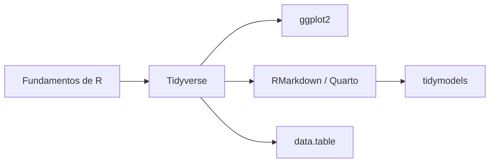

# R Software — Skills esenciales

> [!abstract] Pregunta de investigación
> ¿Qué hay que dominar para programar en R de forma efectiva y moderna?

---

## Fundamentos

- ==**Tidyverse**== — el núcleo del R moderno: `dplyr`, `tidyr`, `ggplot2`, `readr`, `purrr`
- **RMarkdown / Quarto** — documentos reproducibles que mezclan código y texto
- **R Projects + `renv`** — gestión de entornos y reproducibilidad entre máquinas

---

## Manipulación de datos

| Paquete | Para qué sirve |
|---------|---------------|
| `dplyr` | Verbos para transformar datos: `filter`, `mutate`, `group_by`, `summarise` |
| `tidyr` | Pivotar y limpiar: `pivot_longer`, `pivot_wider`, `unnest` |
| `data.table` | Datasets muy grandes — mucho más rápido que dplyr |
| `lubridate` | Fechas y horas |
| `stringr` | Manipulación de texto y regex |

---

## Visualización

| Paquete | Para qué sirve |
|---------|---------------|
| `ggplot2` | Gramática de gráficos — estándar de facto |
| `plotly` | Gráficos interactivos (convierte ggplot2 fácilmente) |
| `highcharter` | Gráficos interactivos estilo dashboards |
| `patchwork` | Componer múltiples gráficos en un layout |

---

## Estadística y modelado

| Paquete | Para qué sirve |
|---------|---------------|
| `broom` | Convierte resultados de modelos en tibbles |
| `tidymodels` | Pipeline de ML consistente con el tidyverse |
| `lme4` | Modelos mixtos |
| `survival` | Análisis de supervivencia |

---

## Productividad y buenas prácticas

> [!tip] Entornos recomendados
> **RStudio** es el IDE estándar. **Positron** (el nuevo IDE de Posit) es la apuesta moderna y vale la pena explorar.

- `usethis` — scaffolding de proyectos y paquetes
- `testthat` — testing de funciones propias
- **Vectorización** — evitar loops usando `apply`, `map` (purrr), o vectores nativos
- **Estilo**: seguir la [guía de estilo de Tidyverse](https://style.tidyverse.org/)

---

## Ruta de aprendizaje sugerida

> [!tip] Por dónde empezar
> - **Empezando**: Tidyverse + RMarkdown
> - **Con base**: tidymodels para ML o Quarto para publicar análisis
> - **Datos grandes**: data.table

---

## Recursos

- [[fuentes/R for Data Science]] %%crear nota cuando se lea el libro%%
- [R for Data Science (online, gratis)](https://r4ds.hadley.nz/) — Hadley Wickham
- [Tidyverse.org](https://www.tidyverse.org/)
- [Posit (RStudio)](https://posit.co/)
